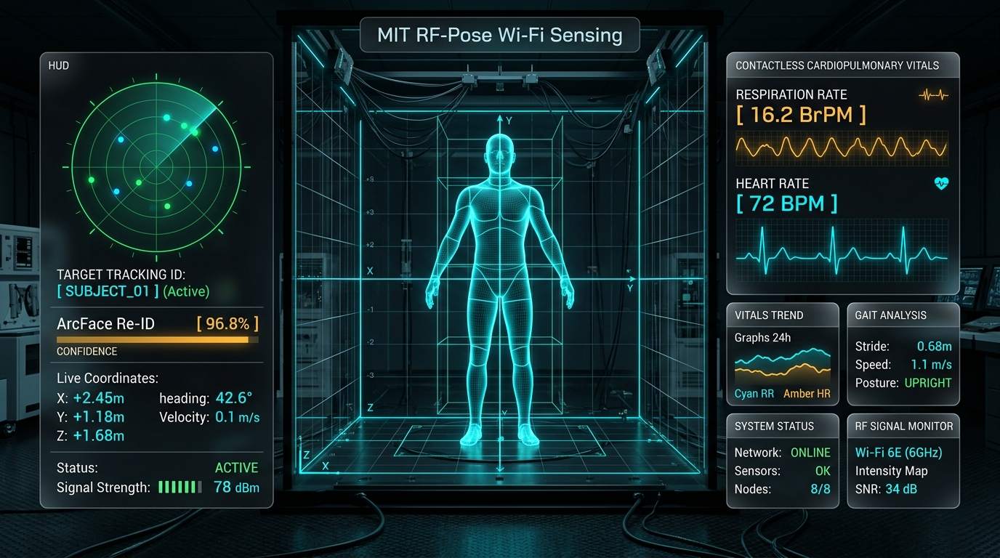
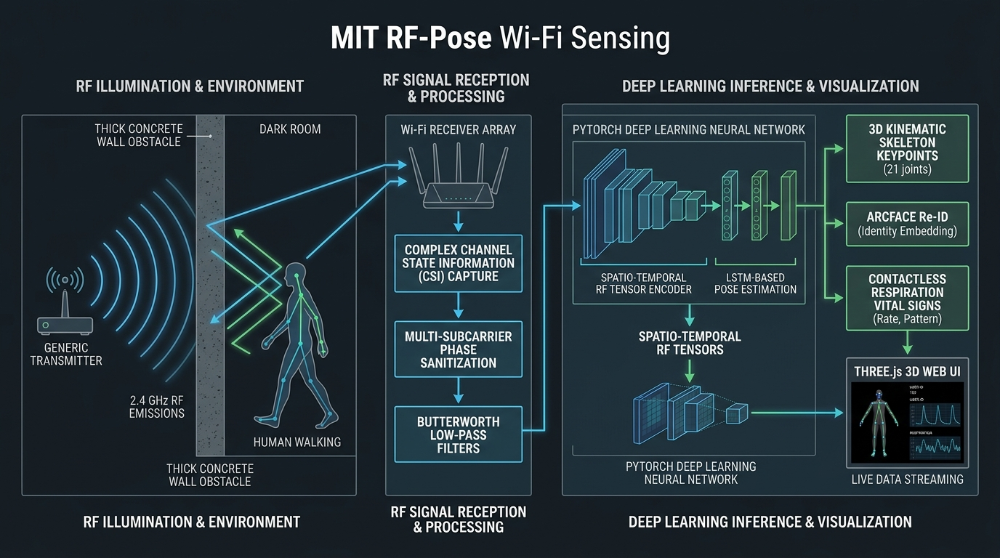

# RF-Sense3D: Edge-Scalable Through-the-Wall Wi-Fi Sensing System

A production-grade, hardware-agnostic architecture for **Passive Through-the-Wall Human Sensing**, **3D Skeleton Reconstruction**, and **Contactless Vital Signs Monitoring** using raw Wi-Fi Channel State Information (CSI) or RF raw payloads, completely bypassing the need for wearable sensors or optical cameras.

> *Inspired by the foundational RF-Pose & RF-Pose3D research principles (Zhao et al., MIT CSAIL).*



---

## 🔬 System Architecture & Physical Pipeline



The system operates across three fundamental layers:
1. **RF Illumination & Physical Propagation**: 2.4 GHz OFDM Wi-Fi radio frequency waves penetrate physical obstacles (concrete walls, partitions, pitch darkness) and reflect off human bodies.
2. **RF Signal Reception & Phase Calibration**: Multi-antenna receiver arrays capture raw Channel State Information (CSI). Subcarrier phase linear sanitization untwists SFO and cancels CFO offsets while Butterworth filter banks isolate cardiopulmonary micro-Doppler signals.
3. **Deep Learning Inference & 3D Holographic Rendering**: A Spatio-Temporal PyTorch neural network (`RFStudentNetwork`) estimates 17 3D skeletal keypoints, calculates ArcFace Re-ID embeddings, and extracts respiration/heart rate waveforms streaming at 100 FPS into an interactive Three.js 3D Web UI.

---

## 🌐 Research References & Public Wi-Fi Datasets

If you want to explore the foundational research literature, video demonstrations, or benchmark on public datasets:

| Project / Dataset | Official Link | Description |
|---|---|---|
| **MIT CSAIL RF-Pose Research** | [http://rfpose.csail.mit.edu/](http://rfpose.csail.mit.edu/) | Landmark research paper on through-wall human pose estimation (CVPR). |
| **MIT RF-Pose3D Research** | [http://rfpose3d.csail.mit.edu/](http://rfpose3d.csail.mit.edu/) | 3D human pose reconstruction literature from radio frequency signals (SIGCOMM). |
| **Tsinghua University Widar 3.0** | [http://tns.thss.tsinghua.edu.cn/widar3.0/](http://tns.thss.tsinghua.edu.cn/widar3.0/) | Large open-source Wi-Fi CSI human sensing dataset for walking gaits and tracking. |
| **Espressif Official ESP-CSI** | [https://github.com/espressif/esp-csi](https://github.com/espressif/esp-csi) | Official Espressif framework and dataset for human presence detection using ESP32. |
| **CSI-Bench Benchmark Suite** | [https://github.com/geek-ai/csi-bench](https://github.com/geek-ai/csi-bench) | Deep learning benchmarking suite on raw Wi-Fi CSI data. |

---

## Key Capabilities

1. **Through-Wall 3D Skeleton Estimation**: Reconstructs 17 COCO 3D kinematic human stick figures in real-time behind concrete walls.
2. **Device-Free Multi-Person Tracking & Re-ID**: Simultaneously tracks distinct human targets, preventing identity swaps with ArcFace metric learning and 3D Kalman filtering.
3. **Contactless Vital Signs Monitoring**: Micro-Doppler phase shift analysis to compute respiration rate (BrPM) and heart rate variations (BPM).
4. **Lighting & NLoS Invariance**: Fully functional in total darkness, smoke, and non-line-of-sight environments.
5. **Cross-Modal Teacher-Student Architecture**: Supervised by vision teacher networks (OpenPose/DensePose) with knowledge distillation into a Spatio-Temporal RF Student Network.

---

## Directory Structure

```
Wi-Fi-Sensing-ESP32-/
├── assets/
│   └── images/                      # Architecture diagrams & UI screenshots
├── main.py                          # Universal CLI controller (Dashboard, Training, Tests)
├── run_tests.py                     # Universal test runner
├── start.bat                        # One-click Windows dashboard launcher
├── analytics/
│   ├── dashboard/
│   │   └── index.html               # Three.js 3D Skeleton & Vitals Dashboard
│   ├── tests/
│   │   └── test_rf_pipeline.py      # Unit & Latency Benchmark Tests
│   ├── rf_signal_processor.py       # DSP, Phase Sanitization & Filter Banks
│   ├── rf_pose_model.py             # PyTorch RFStudentNetwork & Multi-Task Loss
│   ├── multi_target_tracker.py      # 3D Kalman Filter + Hungarian Re-ID Anti-Swap Tracker
│   ├── vision_teacher_network.py    # Cross-Modal 3D ResNet/OpenPose Vision Teacher & KD Loss
│   ├── roi_masking.py               # 3D Spatial Region-of-Interest & Multipath Ghost Filter
│   ├── auth_security.py             # OAuth 2.0 Bearer JWT Authentication & Captcha Verification
│   ├── analytics_store.py           # Supabase & Time-Series Telemetry Persistence Gateway
│   ├── train_rf_pose.py             # Deep Learning Model Training & Evaluation Engine
│   ├── train_model.py               # Unified Trainer (Deep Learning + Classical Presence)
│   ├── kafka_inference_service.py   # Async FastAPI & Kafka/WebSocket Server
│   ├── rf_stream_simulator.py       # Synthetic RF-CSI Physics Generator
│   ├── serial_to_kafka_bridge.py    # ESP32 Serial to Kafka/WebSocket Bridge
│   ├── data_collector.py            # Dataset Recording CLI
│   └── requirements.txt             # Python Dependencies
├── firmware/
│   ├── transmitter/
│   │   └── transmitter.ino          # ESP32 Packet Transmitter
│   └── receiver/
│       └── receiver.ino             # ESP32 CSI Promiscuous Sniffer
├── k8s/
│   └── rf-pose-deployment.yaml      # Kubernetes GPU Deployment Manifest (nvidia.com/gpu: 1)
├── Dockerfile                       # GPU Container Definition
└── docker-compose.yml               # Kafka, Zookeeper & Inference Orchestration
```

---

## Quickstart Guide

### 1. Installation
```bash
pip install -r Wi-Fi-Sensing-ESP32-/analytics/requirements.txt
```

### 2. Run the Real-Time 3D Sensing Engine & Web Dashboard
```bash
python main.py --dashboard
```
Or simply double-click **`start.bat`**.
Open your browser at **`http://localhost:8000`** to interact with the live 3D skeleton visualizer, breathing waveforms, and Re-ID tracks.

### 3. Run Automated Tests & Latency Benchmark
```bash
python run_tests.py
```

### 4. Train the Model with Kinematic & Vital Loss
```bash
python main.py --train
```

### 5. Stream Real ESP32 Hardware
Flash `firmware/transmitter/transmitter.ino` and `firmware/receiver/receiver.ino` to your two ESP32 devices. Then start the serial gateway:
```bash
python main.py --bridge --serial-port COM3
```
